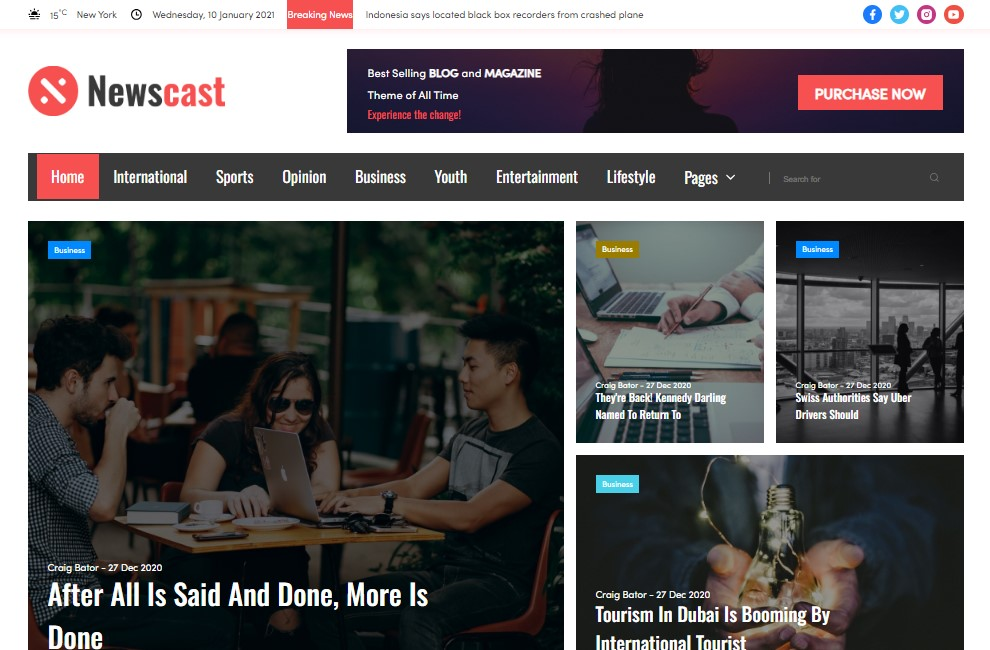

# ℕ𝕖𝕨𝕤 ℂ𝕒𝕤𝕥 
 

A simple workout landing page with an adaptive layout created using CSS Flex technology.

  

## 𝕀𝕟𝕤𝕥𝕒𝕝𝕝𝕒𝕥𝕚𝕠𝕟 ᎓  

To get started with this project, follow the installation instructions below.

1. Clone the repository:
   ```bash
   git clone https://github.com/Morifer79/flex-project_news-cast.git
   ```
2. Open to view it in the browser:  
<a href="https://morifer79.github.io/flex-project_news-cast/"></a>

## 𝔼𝕞𝕒𝕚𝕝 𝕞𝕖 ᎓  
Questions, suggestions, help:  
<a href="mailto:cyber-morifer@proton.me"></a>
